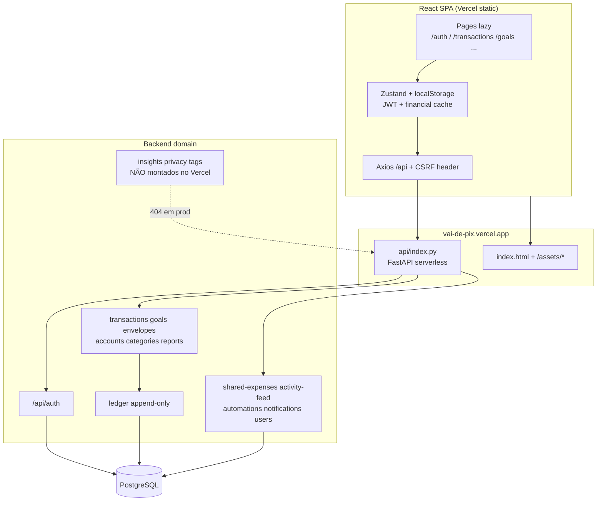

# Relatório de Auditoria em Produção — VAI DE PIX

**URL:** https://vai-de-pix.vercel.app/  
**Data:** 2026-07-13  
**Escopo:** análise ponta a ponta (código + testes live autenticados)  
**Conta testada:** Jose Wallace (`wallace.ventura@outlook.com`)  
**Método:** black-box na API de produção + revisão estática do repositório  

> **Segurança operacional:** a senha foi compartilhada em texto claro no chat. **Recomenda-se trocá-la imediatamente** após esta auditoria. Este relatório **não** contém senhas nem tokens.

---

## 1. Resumo executivo

O app está **no ar**, com healthcheck saudável (`database: connected`) e shell SPA servido pela Vercel. O login funciona, a maioria das leituras responde em ~150–180 ms e os fluxos financeiros básicos (receita, despesa, transferência, metas, caixinhas, contas, categorias, automações, feed) operam quando usados **sem** `Idempotency-Key`.

Há, porém, regressões graves em produção:

| Severidade | Achado |
|------------|--------|
| **P0** | Header `Idempotency-Key` causa timeout ~30 s e HTTP 500 em `POST /transactions` e `POST /goals` |
| **P0** | Routers de **insights**, **privacy** e **tags** não estão montados no entrypoint Vercel (`api/index.py`) → 404 em produção |
| **P1** | CORS libera `http://localhost:5000` em produção (provável `ENVIRONMENT != production`) |
| **P1** | JWT em `localStorage`; logout **não** invalida o access token (válido ~30 min) |
| **P1** | Headers de segurança de app ausentes (CSP, X-Frame-Options, etc.); só HSTS da Vercel |
| **P2** | Rate limit de login não disparou após 7 tentativas inválidas |
| **P2** | `automations.service.ts` prefixa `/api/automations` com baseURL já `/api` → risco de `/api/api/...` |
| **P2** | Conta do usuário sem dados financeiros ativos (0 transações / 0 metas no momento do teste) |

**Veredito:** produção **utilizável para navegação e CRUD básico pela UI** (a UI hoje não envia `Idempotency-Key`), mas **não pronta** para o contrato documentado de idempotência, LGPD (export/delete) nem insights — esses módulos estão offline no deploy atual.

---

## 2. Estrutura ponta a ponta



### 2.1 Frontend (rotas)

| Rota | Função | Protegida |
|------|--------|-----------|
| `/auth` | Login / registro | Não |
| `/` | Dashboard | Sim |
| `/transactions` | Lançamentos | Sim |
| `/goals` | Metas | Sim |
| `/envelopes` | Caixinhas | Sim |
| `/shared-expenses` | Despesas compartilhadas | Sim |
| `/shared-expenses/pending` | Convites | Sim |
| `/activity-feed` | Feed | Sim |
| `/reports` | Relatórios | Sim |
| `/trends` | Tendências | Sim |
| `/automations` | Automações | Sim |
| `/settings` | Configurações | Sim |

Stack UI: React + TypeScript, shadcn/Radix, Tailwind, tema verde WhatsApp (`#128c7e` / `#25d366`), Zustand + Axios (React Query pouco usado).

### 2.2 Backend (deploy Vercel)

Montados em `api/index.py`: auth, transactions, goals, envelopes, categories, accounts, reports, automations, notifications, shared-expenses, activity-feed, users.

**Ausentes no deploy Vercel (existem no código / em `main.py`):** `insights`, `privacy`, `tags`, WebSocket do feed.

---

## 3. Perfil da conta testada

| Campo | Valor |
|-------|-------|
| Nome | Jose Wallace |
| Email | `wallace.ventura@outlook.com` |
| ID | `6bc374e0-79ec-43c1-a467-157c42065926` |
| Ativo | sim |
| Criado em | 2026-02-14 |
| Contas | 4 padrão (Dinheiro, Conta Corrente, Cartão, Poupança) — saldos 0 após limpeza |
| Categorias | 15 |
| Transações | 0 (antes e após limpeza dos recursos de auditoria) |
| Metas / caixinhas | 0 |
| Automações | 1 (`Salario mensal`, ativa) |
| Notificações | 6 (histórico de shares) |
| Feed | 48 itens (`expense_share_*`) |
| Pendências share | 0 |
| Read-model shares | possui histórico (ex.: “X salada”, status cancelled) |

**Nota:** o email informado inicialmente (`@outylook.com`) é typo; a conta válida é `@outlook.com`.

---

## 4. Matriz de testes funcionais (produção)

Legenda: ✅ ok · ⚠️ parcial · ❌ falha · ⊘ N/A no deploy

| Fluxo | Resultado | Latência / obs. |
|-------|-----------|-----------------|
| Health `/api/health` | ✅ | ~150–185 ms · `healthy` + DB |
| Login inválido | ✅ | 401 genérico (“Email ou senha incorretos”) |
| Login válido | ✅ | ~430–550 ms (bcrypt) |
| `GET /auth/me` | ✅ | ~176 ms |
| `PUT /auth/me` | ✅ | ~304 ms |
| Listar contas/categorias/tx/goals/envelopes | ✅ | ~150–180 ms |
| Criar receita **sem** Idempotency-Key | ✅ | ~223 ms |
| Criar despesa (com saldo) | ✅ | ~223 ms |
| Despesa sem saldo | ✅ | 422 `TX_INSUFFICIENT_BALANCE` |
| Transferência entre contas | ✅ | ~242 ms · gera 2 pernas no livro |
| Excluir transações + saldo derivado | ✅ | saldos voltaram a 0 |
| Criar meta **sem** Idempotency-Key | ✅ | ~162–210 ms |
| `POST .../goals/{id}/add-value?amount=` | ✅ | query param (UI alinhada) |
| Criar/atualizar/excluir envelope | ✅ | add/withdraw via query |
| CRUD categoria / conta | ✅ | |
| CRUD automação | ✅ | |
| Marcar notificações / feed lidos | ✅ | |
| Shared-expense convite email inexistente | ✅ | 400 mensagem clara |
| Shared-expense auto-convite | ✅ | 400 “Não é possível convidar a si mesmo” |
| `POST` com **Idempotency-Key** (txn/goal) | ❌ | ~30160 ms → **500** |
| Insights | ⊘ | 404 |
| Privacy export / delete-account | ⊘ | 404 |
| Tags | ⊘ | 404 |
| Refresh token | ⊘ | 400 `USE_REFRESH_TOKENS` desabilitado |
| Seed admin | ✅ bloqueio | 403 “Acesso restrito a administradores” |

Recursos temporários `[AUDIT*]` criados nos testes foram **removidos**; saldos finais das contas padrão: **0**.

---

## 5. Performance e fluidez

### 5.1 API (GETs autenticados ok)

| Métrica | Valor |
|---------|-------|
| min | 150 ms |
| p50 | ~160 ms |
| p90 | ~175 ms |
| p95 | ~176 ms |
| max | ~185 ms |
| média | ~162 ms |
| Waterfall sequencial (~23 reads) | **~3,6 s** |

`GET /accounts/` ×10 (warm): média **153 ms**, estável.

Escritas saudáveis (sem idempotency): **160–250 ms**.  
Escritas com `Idempotency-Key`: **~30,1 s** → timeout da função serverless.

### 5.2 Frontend / assets

| Recurso | Tamanho | TTFB aprox. | Cache |
|---------|---------|-------------|-------|
| HTML | 717 B | ~49 ms | HIT |
| `index-*.js` | ~220 KB | ~50 ms | HIT |
| `vendor-*.js` | ~161 KB | ~48 ms | HIT |
| CSS / chunks UI | presentes no HTML (modulepreload) | — | Vercel |

Rotas SPA (`/transactions`, `/goals`, etc.) respondem 200 com o shell — deep-link ok.

### 5.3 Fluidez de navegação (inferida)

- Lazy routes + chunks `vendor`/`ui` ajudam first load.
- No bootstrap autenticado, `useLoadData` dispara várias GETs; em sequência isso soma **~3–4 s** até o store popular — sensação de “carregando” no primeiro paint pós-login.
- Timeout Axios de 10 s (`API_CONFIG.timeout`) é **menor** que o hang de 30 s da idempotência → se algum cliente passar a enviar a key, a UI falha por timeout sem mensagem de causa raiz.
- Relatórios/tendências recalculam no client a partir do store (ok com poucos dados; escala mal com milhares de lançamentos).
- **Sem browser automation neste ambiente:** avaliação visual/UX é por código + métricas de rede, não por sessão real de clique.

### 5.4 UI / UX (código)

**Pontos positivos**
- Identidade visual coerente (Pix/WhatsApp green), logo em losango, formulário de auth limpo.
- Sidebar com agrupamento (principal / relatórios / config) e tooltips.
- Error boundaries por página; toasts de feedback.
- Forms de meta/envelope já usam `params: { amount }` compatível com a API.

**Pontos negativos**
- Poucos `aria-*` / sem skip link (já na auditoria de 07/07).
- 0 testes frontend.
- Persistência de dados financeiros em `localStorage` (além do JWT) — risco de XSS e stale data.
- Tela de Insights / export LGPD provavelmente quebradas ou ociosas em produção (404 API).
- Bug latente: `automationsService` chama `/api/automations/` com `baseURL=/api`.

---

## 6. Segurança

### 6.1 Controles que funcionaram

| Controle | Evidência |
|----------|-----------|
| Auth obrigatória | Sem token → 403; JWT inválido → 401 |
| Mensagem de login genérica | Não enumera se o email existe |
| IDOR admin seed | 403 para não-admin |
| Ownership em deletes/gets de recurso inexistente | 404 |
| Shared expenses | Bloqueio de self-invite e email inexistente |
| Senha | bcrypt (latência de login ~0,4–0,5 s) |
| OpenAPI/docs | Desabilitados no app FastAPI em Vercel (`/api/docs` 404) |
| HSTS | Presente (`max-age=63072000; includeSubDomains; preload`) |

### 6.2 Falhas / riscos

1. **Idempotência quebrada (P0)** — qualquer cliente que envie `Idempotency-Key` trava a lambda ~30 s e recebe 500. Hipótese: sessão/tabela de idempotência ou lock em ambiente serverless. A UI atual **não** envia a key (por isso o app “parece” ok).

2. **Módulos de privacidade/insights offline (P0 funcional / LGPD)** — sem `/privacy/export` e `/privacy/delete-account` no deploy, direitos do titular ficam inacessíveis via API pública atual.

3. **CORS com localhost em produção (P1)** — resposta real: `Access-Control-Allow-Origin: http://localhost:5000`. Código em `api/index.py` só restringe origens quando `ENVIRONMENT=production`; `VERCEL=1` sozinho não ativa o allowlist estrito. Origem `evil.example` **não** recebe ACAO (bom), mas escrita com `Origin` malicioso ainda processa se o atacante tiver o Bearer (esperado com JWT em header).

4. **JWT no localStorage + logout cosmética (P1)** — após `POST /auth/logout`, o mesmo access token continua autenticando `/auth/me` até `exp` (~**1800 s / 30 min**). Claims JWT: apenas `sub` + `exp` (sem `iat`/`jti` → revogação difícil).

5. **Security headers de aplicação ausentes (P1)** — sem CSP, `X-Frame-Options`, `X-Content-Type-Options`, `Referrer-Policy`, `Permissions-Policy`. Há módulo `security_headers.py` no repo, mas **não wired** no entrypoint Vercel.

6. **Rate limit de login ineficaz no teste (P2)** — 7 logins inválidos seguidos → sempre 401, sem `Retry-After` / 429. Em serverless, SlowAPI por IP de edge pode ser inadequado (comentário no próprio `api/index.py`).

7. **CSRF header opcional com Bearer (P2)** — mutação sem `X-CSRF-Token` foi aceita. Aceitável enquanto o access token não for cookie; risco sobe se refresh HttpOnly for ligado.

8. **Senha mínima 6 caracteres no register (P2)** — fraca para app financeiro (há `PasswordValidator` no register backend — validar se regras fortes estão ativas em prod).

9. **Override `localStorage['vai-de-pix-api-url']` (P2)** — em cenários XSS, redireciona o client a API atacante.

### 6.3 Modelo de ameaça resumido (produção atual)

```
XSS no SPA → roubo JWT localStorage → API completa do usuário até exp
Attacker com token → CRUD financeiro; seed admin bloqueado
Sem CSRF clássico relevante (Bearer) enquanto refresh cookie off
Idempotency hang → DoS leve por request autenticado (30s/função)
```

---

## 7. Dados e invariantes financeiros

- Ledger append-only: criar receita/despesa/transferência e deletar restaurou saldos para 0 — consistente com o modelo.
- Validação de saldo insuficiente: 422 estruturado (`code: TX_INSUFFICIENT_BALANCE`).
- Transferência gera descrição espelhada nas duas pernas; delete de uma perna pode 404 a “irmã” (já removida / vínculo) — vale documentar o comportamento de estorno.
- Conta do usuário está “limpa” (sem lançamentos), então dashboard/relatórios aparecem vazios — não é bug, é estado dos dados.

---

## 8. Divergências código ↔ produção

| Item | Repo | Produção observada |
|------|------|--------------------|
| Insights / privacy / tags | Existem routers | 404 |
| Idempotência | Documentada e middleware | Timeout 500 |
| Security headers | Módulo + docs/testes | Não aplicados |
| Refresh tokens | Flag `USE_REFRESH_TOKENS` | Desligado |
| CORS prod | Allowlist se `ENVIRONMENT=production` | localhost permitido |
| OpenAPI | Condicional | Não exposto em `/api` |

---

## 9. Priorização de correções

1. **Investigar e corrigir hang da idempotência em serverless** (sessão separada / `pg_advisory` / cold start / conexão DB). Adicionar teste e2e em staging com a key.
2. **Montar routers `insights`, `privacy` (e tags se usados)** em `api/index.py` ou remover UI morta.
3. **Definir `ENVIRONMENT=production`** no Vercel e retirar localhost do CORS em prod.
4. **Wire `SecurityHeadersMiddleware`** (CSP report-only → enforce).
5. **Refresh HttpOnly + access curto** ou denylist/`jti` no logout.
6. **Rate limit na edge (Vercel WAF)** para `/api/auth/login`.
7. Corrigir paths de `automations.service.ts` (`/automations/` sem duplicar `/api`).
8. Reduzir waterfall do bootstrap (Promise.all + skeleton; paginação de transactions já existe `limit≤100`).

---

## 10. Metodologia e limitações

- Testes live via HTTPS contra produção com a conta fornecida; recursos de auditoria limpos ao final.
- Sem acesso a logs da Vercel/DB; causa raiz do hang de idempotência não instrumentada além do sintoma (30 s / 500).
- Sem navegador headless neste ambiente — fluidez visual e a11y de runtime não foram filmadas; baseadas em código + rede.
- Não foi executado teste de carga nem pentest autenticado agressivo (bruteforce além de 7 tentativas).

---

## 11. Anexo — amostra de latências (produção)

```
GET /api/health ..................... ~150–185 ms
POST /auth/login (ok) ............... ~430–550 ms
GET /accounts/ (warm avg×10) ........ ~153 ms
POST /transactions income (no idem) . ~223 ms
POST /transactions (WITH idem) ...... ~30160 ms → 500
POST /goals (no idem) ............... ~162–210 ms
POST /goals (WITH idem) ............. ~30170 ms → 500
Assets HTML/JS ...................... ~47–50 ms (HIT)
```

---

*Gerado automaticamente pela auditoria cloud agent em 2026-07-13. Relatório predecessor de código: `AUDITORIA-VAI-DE-PIX-2026-07-07.md`.*
