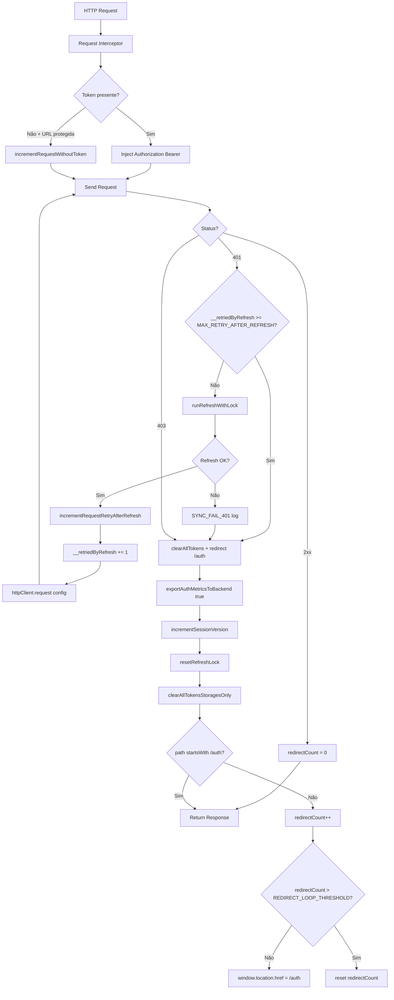

# 1. Auth Request Lifecycle

Request → Interceptor → Token Check → API → 401 → Refresh → Retry → Success / Logout.  
Extraído exclusivamente de `src/lib/http-client.ts` e `src/lib/refresh-lock-manager.ts`.

---

## Constantes (código real)

| Constante | Valor | Arquivo |
|-----------|-------|---------|
| MAX_RETRY_AFTER_REFRESH | 1 | http-client.ts L24 |
| REDIRECT_LOOP_THRESHOLD | 5 | http-client.ts L79 |

---

## Fluxograma (Mermaid)

---

## Mapping Código → Diagrama

| Nó / decisão no diagrama | Código (arquivo: trecho) |
|---------------------------|---------------------------|
| Request Interceptor | http-client.ts L60–75: interceptor request, getTokenForRequest(), isPublicAuthUrl |
| incrementRequestWithoutToken | http-client.ts L69–70: else if !isPublicAuthUrl(config.url) |
| Status 401, RetryCheck | http-client.ts L90–93: status === 401, (config.__retriedByRefresh ?? 0) >= MAX_RETRY_AFTER_REFRESH |
| runRefreshWithLock | http-client.ts L94; refresh-lock-manager.ts L28–79 |
| incrementRequestRetryAfterRefresh | http-client.ts L96 |
| httpClient.request(config) | http-client.ts L98 |
| clearAllTokens | http-client.ts L46–51, L107: exportAuthMetricsToBackend(true), incrementSessionVersion, resetRefreshLock, clearAllTokensStoragesOnly |
| redirectCount, REDIRECT_LOOP_THRESHOLD | http-client.ts L77–78, L111–116 |

---

## Self-Audit

| Pergunta | Resposta | Evidência |
|----------|----------|-----------|
| Fluxo bate com código? | Sim | Ordem: request interceptor → send → response; 401 → retry check → runRefreshWithLock → retry 1x ou clear |
| Locks existem no código? | Sim | runRefreshWithLock usa refreshPromise (in-process) + tryAcquireCrossTabLock (cross-tab) |
| Timeouts existem no código? | N/A neste fluxo | Timeout do refresh está no fluxo 2 (REFRESH_TIMEOUT_MS) |
| Retries existem no código? | Sim | MAX_RETRY_AFTER_REFRESH = 1; __retriedByRefresh no config |
| Eventos multi-tab existem no código? | Sim | runRefreshWithLock chama tryAcquireCrossTabLock e waitForRefreshResultFromOtherTab |
| Fallbacks existem no código? | Sim | clearAllTokens + redirect /auth; REDIRECT_LOOP_THRESHOLD evita loop infinito |

---

## Modo Elite

### Checklist QA baseado no fluxo
- [ ] Request sem token em URL protegida: incrementRequestWithoutToken chamado; resposta pode 401.
- [ ] 401 com retry disponível: runRefreshWithLock executado; se true, request reenviado exatamente 1 vez.
- [ ] 401 após 1 retry ou refresh falhou: clearAllTokens e redirect /auth.
- [ ] 403: clearAllTokens e redirect (sem tentar refresh).
- [ ] Redirect loop: após 5 redirects, redirectCount zerado e não redireciona de novo.

### Pontos de falha crítica
- clearAllTokens não executado (ex.: exceção antes): sessão pode ficar inconsistente.
- runRefreshWithLock nunca chamado em 401: usuário sempre cai em logout sem tentar refresh.

### Gargalos de performance
- runRefreshWithLock é async; todas as requests 401 concorrentes aguardam a mesma Promise (projetado).

### Riscos multi-aba
- Várias abas com 401: uma executa refresh (lock), outras aguardam resultado via BroadcastChannel; risco de todas verem false se líder falhar.

### Riscos de race condition
- __retriedByRefresh no config: garantido por axios (mesmo config reutilizado no retry).

### Riscos de refresh storm
- Mitigado por MAX_RETRY_AFTER_REFRESH = 1 (um retry por request) e por runRefreshWithLock (um refresh por vez por aba + cross-tab lock).
