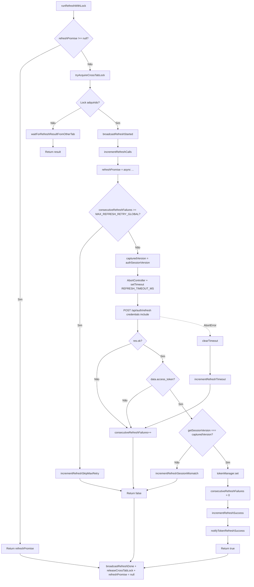

# 2. Refresh Pipeline Real

Lock Acquire → Refresh Internal → Timeout Guard → Retry Global Guard → Session Version Check → Token Store Update → Broadcast Success → Lock Release.  
Extraído de `src/lib/refresh-lock-manager.ts` e `src/lib/refresh-internal.ts`.

---

## Constantes (código real)

| Constante | Valor | Arquivo |
|-----------|-------|---------|
| REFRESH_TIMEOUT_MS | 10_000 | refresh-internal.ts L19 |
| MAX_REFRESH_RETRY_GLOBAL | 2 | refresh-internal.ts L21 |

---

## Fluxograma (Mermaid)

---

## Mapping Código → Diagrama

| Nó / decisão | Código (arquivo: trecho) |
|--------------|---------------------------|
| refreshPromise !== null | refresh-lock-manager.ts L29–31: retorna refreshPromise |
| tryAcquireCrossTabLock | refresh-lock-manager.ts L34–40; cross-tab-refresh-coordinator.ts L78–91 |
| waitForRefreshResultFromOtherTab | refresh-lock-manager.ts L35–38; cross-tab-refresh-coordinator.ts L133–159 |
| broadcastRefreshStarted, incrementRefreshCalls | refresh-lock-manager.ts L46–47 |
| consecutiveRefreshFailures >= MAX_REFRESH_RETRY_GLOBAL | refresh-internal.ts L50–56, incrementRefreshSkipMaxRetry |
| capturedVersion, authSessionVersion | refresh-internal.ts L57–58 |
| AbortController, REFRESH_TIMEOUT_MS | refresh-internal.ts L60–61, L71 |
| POST /api/auth/refresh | refresh-internal.ts L59–69 |
| getSessionVersion() !== capturedVersion | refresh-internal.ts L84–89, incrementRefreshSessionMismatch |
| tokenManager.set | refresh-internal.ts L91 |
| consecutiveRefreshFailures = 0 | refresh-internal.ts L92 |
| incrementRefreshSuccess, notifyTokenRefreshSuccess | refresh-internal.ts L93–95 |
| AbortError, incrementRefreshTimeout | refresh-internal.ts L96–105 |
| finally: broadcastRefreshDone, releaseCrossTabLock, refreshPromise = null | refresh-lock-manager.ts L63–75 |

---

## Self-Audit

| Pergunta | Resposta | Evidência |
|----------|----------|-----------|
| Fluxo bate com código? | Sim | Ordem: lock check → cross-tab → retry guard → timeout → fetch → session version → token set → notify → finally |
| Locks existem no código? | Sim | refreshPromise (in-process); tryAcquireCrossTabLock/releaseCrossTabLock (cross-tab) |
| Timeouts existem no código? | Sim | REFRESH_TIMEOUT_MS = 10_000, setTimeout(controller.abort) |
| Retries existem no código? | Sim | MAX_REFRESH_RETRY_GLOBAL = 2, consecutiveRefreshFailures |
| Eventos multi-tab existem no código? | Sim | broadcastRefreshStarted, broadcastRefreshDone, waitForRefreshResultFromOtherTab |
| Fallbacks existem no código? | Sim | finally sempre libera lock; falha de refresh retorna false (caller trata) |

---

## Modo Elite

### Checklist QA
- [ ] Concorrência: múltiplas chamadas a runRefreshWithLock aguardam a mesma Promise.
- [ ] Retry global: após 2 falhas consecutivas, incrementRefreshSkipMaxRetry e return false até nova sessão (resetRefreshRetryCount em login).
- [ ] Timeout: após 10s sem resposta do backend, AbortError e incrementRefreshTimeout.
- [ ] Session version: logout chama incrementSessionVersion; refresh in-flight não grava token se versão mudou.

### Pontos de falha crítica
- Backend /auth/refresh indisponível: lock é liberado no finally; próximas 401 tentam de novo (respeitando MAX_REFRESH_RETRY_GLOBAL).
- tokenManager.set não chamado em session mismatch: correto; token antigo permanece até logout/redirect.

### Gargalos
- Uma única refresh por vez por aba; todas as 401 da aba aguardam o mesmo resultado (projetado).

### Riscos multi-aba
- Aba líder trava antes do finally: lock cross-tab tem TTL 15s (LOCK_TTL_MS); outra aba pode assumir após expiração.

### Riscos de race condition
- capturedVersion lido no início; getSessionVersion() lido após receber token; logout entre os dois gera session mismatch (comportamento correto).

### Riscos de refresh storm
- Mitigado por lock in-process + cross-tab e por MAX_REFRESH_RETRY_GLOBAL.
