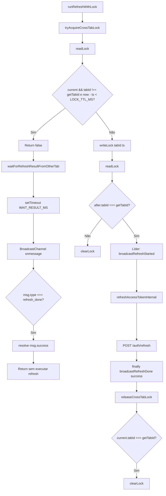

# 3. Multi-Tab Refresh Coordination

Tab Detect Expiry → Election → Leader Refresh → Followers Wait → Broadcast Result → Resume Requests.  
Extraído de `src/lib/cross-tab-refresh-coordinator.ts` e `src/lib/refresh-lock-manager.ts`.

---

## Constantes (código real)

| Constante | Valor | Arquivo |
|-----------|-------|---------|
| LOCK_TTL_MS | 15_000 | cross-tab-refresh-coordinator.ts L10 |
| WAIT_RESULT_MS | 14_000 | cross-tab-refresh-coordinator.ts L11 |
| STORAGE_KEY | "vdp_refresh_lock" | cross-tab-refresh-coordinator.ts L8 |
| CHANNEL_NAME | "vdp_auth_refresh" | cross-tab-refresh-coordinator.ts L9 |

---

## Fluxograma (Mermaid)

---

## Mapping Código → Diagrama

| Nó / decisão | Código (arquivo: trecho) |
|--------------|---------------------------|
| tryAcquireCrossTabLock | refresh-lock-manager.ts L34; cross-tab-refresh-coordinator.ts L78–91 |
| readLock, now - current.ts < LOCK_TTL_MS | cross-tab-refresh-coordinator.ts L80–84 |
| Return false (não líder) | cross-tab-refresh-coordinator.ts L84 |
| waitForRefreshResultFromOtherTab | cross-tab-refresh-coordinator.ts L133–159: Promise com setTimeout(WAIT_RESULT_MS), onmessage refresh_done |
| writeLock, Re-read, weWon | cross-tab-refresh-coordinator.ts L85–90 |
| clearLock se !weWon | cross-tab-refresh-coordinator.ts L90 |
| broadcastRefreshStarted | refresh-lock-manager.ts L46; cross-tab-refresh-coordinator.ts L104–114 |
| refreshAccessTokenInternal | refresh-lock-manager.ts L58 |
| broadcastRefreshDone, releaseCrossTabLock | refresh-lock-manager.ts L64–65 |
| releaseCrossTabLock: clearLock se tabId desta aba | cross-tab-refresh-coordinator.ts L95–99 |

---

## Self-Audit

| Pergunta | Resposta | Evidência |
|----------|----------|-----------|
| Fluxo bate com código? | Sim | tryAcquire: readLock → TTL check → writeLock → re-read → weWon; followers: waitForRefreshResultFromOtherTab |
| Locks existem no código? | Sim | localStorage vdp_refresh_lock com tabId + ts; LOCK_TTL_MS 15s |
| Timeouts existem no código? | Sim | LOCK_TTL_MS 15_000; WAIT_RESULT_MS 14_000 (espera por resultado) |
| Retries existem no código? | N/A | Retry de refresh está no fluxo 2 (MAX_REFRESH_RETRY_GLOBAL) |
| Eventos multi-tab existem no código? | Sim | BroadcastChannel vdp_auth_refresh; refresh_started, refresh_done |
| Fallbacks existem no código? | Sim | Sem BroadcastChannel: getChannel() null, waitForRefreshResultFromOtherTab resolve false; tryAcquire retorna true (SSR/undefined window) |

---

## Modo Elite

### Checklist QA
- [ ] Duas abas com 401: uma adquire lock (weWon), outra entra em waitForRefreshResultFromOtherTab.
- [ ] Líder termina: broadcastRefreshDone(success); followers resolvem com msg.success.
- [ ] Timeout 14s: se líder não enviar refresh_done, followers resolvem false.
- [ ] Lock expirado (15s): readLock retorna outro tabId com ts antigo; nova aba pode writeLock e vencer.

### Pontos de falha crítica
- BroadcastChannel indisponível: followers não recebem refresh_done; timeout 14s resolve false (comportamento seguro).
- Duas abas escrevem ao mesmo tempo: re-read após writeLock; apenas uma weWon (best-effort no código).

### Gargalos
- Followers bloqueiam até resultado ou 14s (async; não bloqueia UI).

### Riscos multi-aba
- Líder crasha antes de broadcastRefreshDone: lock expira em 15s; próxima 401 em qualquer aba pode adquirir lock.

### Riscos de race condition
- Race em writeLock: duas abas podem escrever; re-read reduz (não elimina) chance de duas se considerarem líderes; clearLock se !weWon evita lock órfão.

### Riscos de refresh storm
- Uma única líder por TTL; followers não disparam novo fetch.
