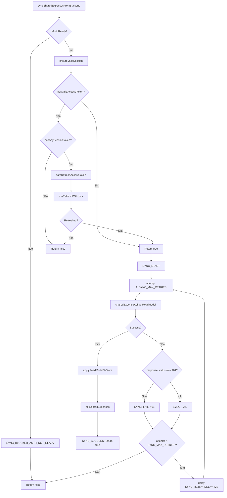

# 4. Sync Engine Runtime Flow

Auth Ready → Valid Session → API Call → Refresh If Needed → Retry Limited → Store Update.  
Extraído de `src/lib/shared-expenses-sync-engine.ts` e `src/lib/auth-runtime-guard.ts`.

---

## Constantes (código real)

| Constante | Valor | Arquivo |
|-----------|-------|---------|
| WAIT_AUTH_READY_TIMEOUT_MS | 15_000 | auth-runtime-guard.ts L15 |
| WAIT_AUTH_POLL_MS | 100 | auth-runtime-guard.ts L16 |
| SYNC_RETRY_DELAY_MS | 2000 | shared-expenses-sync-engine.ts L16 |
| SYNC_MAX_RETRIES | 2 | shared-expenses-sync-engine.ts L17 |

---

## Fluxograma (Mermaid)

---

## Mapping Código → Diagrama

| Nó / decisão | Código (arquivo: trecho) |
|--------------|---------------------------|
| isAuthReady | shared-expenses-sync-engine.ts L61–65; auth-runtime-guard.ts L22–26 (isAuthChecking === false) |
| ensureValidSession | shared-expenses-sync-engine.ts L67–71; auth-runtime-guard.ts L86–99 |
| hasValidAccessToken | auth-runtime-guard.ts L31–34 (tokenManager.isValid()) |
| hasAnySessionToken | auth-runtime-guard.ts L39–41; auth-session.ts |
| safeRefreshAccessToken | auth-runtime-guard.ts L105–106 → runRefreshWithLock |
| sharedExpenseApi.getReadModel | shared-expenses-sync-engine.ts L76; services/sharedExpenseApi |
| applyReadModelToStore, setSharedExpenses | shared-expenses-sync-engine.ts L48–52, L77 |
| attempt, SYNC_MAX_RETRIES, SYNC_RETRY_DELAY_MS | shared-expenses-sync-engine.ts L75, L88–89 |

---

## Self-Audit

| Pergunta | Resposta | Evidência |
|----------|----------|-----------|
| Fluxo bate com código? | Sim | isAuthReady → ensureValidSession (hasValid ou safeRefresh) → for attempt → getReadModel → apply ou retry com delay |
| Locks existem no código? | Sim | ensureValidSession usa runRefreshWithLock (fluxo 2) |
| Timeouts existem no código? | Sim | waitUntilAuthReady usa WAIT_AUTH_READY_TIMEOUT_MS (sync não chama waitUntilAuthReady diretamente; quem chama pode usar) |
| Retries existem no código? | Sim | SYNC_MAX_RETRIES = 2, SYNC_RETRY_DELAY_MS = 2000 |
| Eventos multi-tab existem no código? | Indireto | Sync não coordena entre abas; refresh usado por ensureValidSession é multi-tab via runRefreshWithLock |
| Fallbacks existem no código? | Sim | Sem sessão válida: return false; getReadModel falha: retry com delay até 2 tentativas |

---

## Modo Elite

### Checklist QA
- [ ] Auth não pronto: sync retorna false sem chamar API.
- [ ] Sessão inválida e sem token: ensureValidSession retorna false; sync retorna false.
- [ ] Token expirado com refresh cookie: ensureValidSession chama runRefreshWithLock; se OK, getReadModel segue.
- [ ] getReadModel 401: interceptor pode fazer refresh e retry; sync vê sucesso ou faz sua própria retry (2x com 2s).

### Pontos de falha crítica
- ensureValidSession false: sync não chama getReadModel (evita 401 em cascata).
- Duas abas sincronizando: ambas podem chamar getReadModel (sem lock de sync); backend é fonte de verdade.

### Gargalos
- ensureValidSession pode disparar um refresh (lock compartilhado com interceptor).

### Riscos multi-aba
- Múltiplas abas sync em paralelo: múltiplos getReadModel; não há lock de sync (aceitável para read-model).

### Riscos de race condition
- setSharedExpenses substitui estado do store; última sync a terminar “vence” (comportamento esperado para read-model).

### Riscos de refresh storm
- ensureValidSession usa runRefreshWithLock; uma refresh por vez (in-process + cross-tab).
