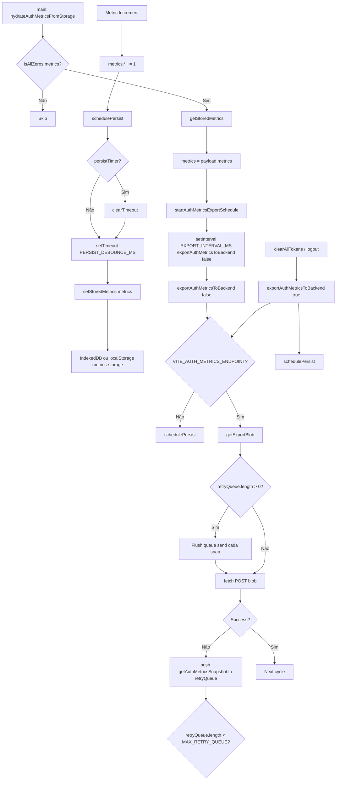

# 5. Metrics Lifecycle

Metric Increment → Debounce Persist → Export Scheduler → Retry Queue → Backend Export.  
Extraído de `src/lib/metrics/auth-metrics.ts` e `src/lib/metrics/metrics-storage.ts`.

---

## Constantes (código real)

| Constante | Valor | Arquivo |
|-----------|-------|---------|
| PERSIST_DEBOUNCE_MS | 500 | auth-metrics.ts L19 |
| EXPORT_INTERVAL_MS | 60_000 | auth-metrics.ts L93 |
| MAX_RETRY_QUEUE | 100 | auth-metrics.ts L106 |

---

## Fluxograma (Mermaid)

---

## Mapping Código → Diagrama

| Nó / decisão | Código (arquivo: trecho) |
|--------------|---------------------------|
| hydrateAuthMetricsFromStorage, isAllZeros | auth-metrics.ts L44–47; L29–38 |
| getStoredMetrics | auth-metrics.ts L47; metrics-storage.ts getStoredMetrics |
| startAuthMetricsExportSchedule, setInterval EXPORT_INTERVAL_MS | auth-metrics.ts L98–103 |
| increment* → schedulePersist | auth-metrics.ts L57–90 (cada increment chama schedulePersist) |
| schedulePersist, PERSIST_DEBOUNCE_MS | auth-metrics.ts L21–27 |
| setStoredMetrics | auth-metrics.ts L26; metrics-storage.ts setStoredMetrics |
| exportAuthMetricsToBackend, VITE_AUTH_METRICS_ENDPOINT | auth-metrics.ts L120–127 |
| retryQueue, MAX_RETRY_QUEUE | auth-metrics.ts L106, L144–146, L139–140 |
| exportAuthMetricsToBackend(true) em clearAllTokens | http-client.ts L49 |

---

## Self-Audit

| Pergunta | Resposta | Evidência |
|----------|----------|-----------|
| Fluxo bate com código? | Sim | hydrate (se zeros) → getStored → startExport; increment → schedulePersist (debounce) → setStored; export → endpoint check → fetch ou schedulePersist; falha → push retryQueue |
| Locks existem no código? | N/A | Métricas não usam lock; apenas contadores em memória + persist assíncrona |
| Timeouts existem no código? | Sim | PERSIST_DEBOUNCE_MS 500; setInterval EXPORT_INTERVAL_MS 60_000 |
| Retries existem no código? | Sim | retryQueue, MAX_RETRY_QUEUE 100; reenvio no próximo export |
| Eventos multi-tab existem no código? | N/A | Métricas por aba (memória local); persist/export por aba |
| Fallbacks existem no código? | Sim | Sem endpoint: schedulePersist apenas; fetch falha: push na fila; setStoredMetrics.catch(() => {}) |

---

## Modo Elite

### Checklist QA
- [ ] Hydrate: só sobrescreve métricas se isAllZeros (evita sobrescrever após incrementos na sessão).
- [ ] Increment: sempre chama schedulePersist (debounce 500ms).
- [ ] Export sem endpoint: apenas schedulePersist; não envia rede.
- [ ] Export com falha: snapshot vai para retryQueue (até 100); próximo ciclo reenvia.

### Pontos de falha crítica
- setStoredMetrics falha: .catch(() => {}); métricas em memória permanecem; próximo hydrate pode não ter dados persistidos.
- retryQueue cheia (100): novos snapshots não entram; possível perda de dados de export (não afeta auth/refresh).

### Gargalos
- setStoredMetrics assíncrono (IndexedDB/localStorage); não bloqueia UI.
- Export a cada 60s; falhas enfileiradas.

### Riscos multi-aba
- Cada aba tem sua cópia de métricas em memória e sua retryQueue; não há agregação cross-tab.

### Riscos de race condition
- Múltiplos increment em sequência: vários schedulePersist; apenas o último timeout persiste (debounce correto).

### Riscos de refresh storm
- N/A; métricas não disparam refresh.
