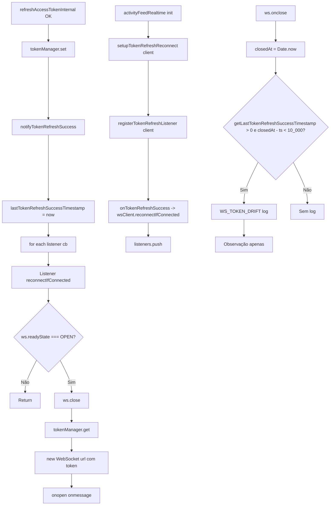

# 6. WebSocket Token Lifecycle

Refresh Success → Notify Listeners → WS Reconnect → Token Drift Monitor.  
Extraído de `src/lib/token-refresh-notify.ts`, `src/lib/refresh-internal.ts` e `src/services/activityFeedRealtime.ts`.

---

## Constantes (código real)

| Constante / Comportamento | Valor / Evidência | Arquivo |
|----------------------------|-------------------|---------|
| WS_TOKEN_DRIFT (janela) | 10_000 ms (hardcoded inline) | activityFeedRealtime.ts L45, L84 |
| getLastTokenRefreshSuccessTimestamp | Atualizado em notifyTokenRefreshSuccess | token-refresh-notify.ts L18, L36–37 |

Não existe constante nomeada `WS_TOKEN_DRIFT_THRESHOLD` no código; a comparação é `closedAt - getLastTokenRefreshSuccessTimestamp() < 10_000`.

---

## Fluxograma (Mermaid)

---

## Mapping Código → Diagrama

| Nó / decisão | Código (arquivo: trecho) |
|--------------|---------------------------|
| tokenManager.set, notifyTokenRefreshSuccess | refresh-internal.ts L91, L95 |
| lastTokenRefreshSuccessTimestamp = now | token-refresh-notify.ts L36–37 |
| for each listener | token-refresh-notify.ts L37–46 |
| registerTokenRefreshListener | token-refresh-notify.ts L23–25; activityFeedRealtime.ts L13–15 |
| reconnectIfConnected | activityFeedRealtime.ts L65–89 |
| ws.readyState !== WebSocket.OPEN → return | activityFeedRealtime.ts L66 |
| ws.close, tokenManager.get, new WebSocket | activityFeedRealtime.ts L68–72 |
| onclose, closedAt - getLastTokenRefreshSuccessTimestamp() < 10_000 | activityFeedRealtime.ts L43–48, L82–87 |

---

## Self-Audit

| Pergunta | Resposta | Evidência |
|----------|----------|-----------|
| Fluxo bate com código? | Sim | refresh-internal após tokenManager.set chama notifyTokenRefreshSuccess; listeners registrados em setupTokenRefreshReconnect; reconnectIfConnected só age se OPEN; onclose verifica janela 10s |
| Locks existem no código? | N/A | WS não usa lock de refresh; apenas reconecta com token atual |
| Timeouts existem no código? | Implícito | Janela 10_000 ms para log WS_TOKEN_DRIFT (não é timeout de rede) |
| Retries existem no código? | N/A | Reconexão é uma nova conexão por evento; não há retry automático de WS no código mostrado |
| Eventos multi-tab existem no código? | N/A | Cada aba tem seu WS; notify é in-process (listeners por aba) |
| Fallbacks existem no código? | Sim | reconnectIfConnected retorna cedo se não OPEN; getChannel/listeners podem estar vazios |

---

## Modo Elite

### Checklist QA
- [ ] Refresh success: notifyTokenRefreshSuccess chamado uma vez; lastTokenRefreshSuccessTimestamp atualizado.
- [ ] WS conectado: reconnectIfConnected fecha e abre novo WS com token atual.
- [ ] WS não conectado: reconnectIfConnected retorna sem fazer nada.
- [ ] WS fecha dentro de 10s após refresh: log [WS_TOKEN_DRIFT].

### Pontos de falha crítica
- Listener lança exceção: try/catch em notifyTokenRefreshSuccess; outros listeners ainda são chamados.
- tokenManager.get() null em reconnectIfConnected: novo WebSocket não é criado (código checa e segue; url seria sem token — verificar atividadeFeedRealtime: há get() antes de new WebSocket).

### Gargalos
- Uma reconexão por evento (não há debounce explícito no notify; múltiplos refresh rápidos = múltiplas notificações).

### Riscos multi-aba
- Cada aba tem seu próprio WS e seus listeners; refresh em uma aba notifica só essa aba.

### Riscos de race condition
- Token lido em reconnectIfConnected pode já estar atualizado (notify é pós tokenManager.set); risco baixo.

### Riscos de refresh storm
- notifyTokenRefreshSuccess não dispara refresh; apenas notifica; reconnect é reação ao refresh já ocorrido.
